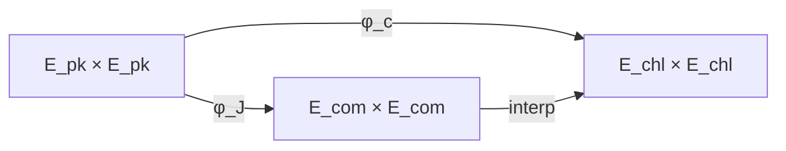

````markdown
---

> ⚠️ **Status: Experimental / Research Prototype**
>
> Dokumen dan implementasi dalam repository ini disediakan untuk tujuan
> riset dan edukasi. Tidak ada jaminan keamanan, ketepatan kriptografi,
> atau kesesuaian produksi. Jangan digunakan dalam sistem nyata tanpa
> audit kriptografi independen dan validasi formal.

# OriSign

### Spesifikasi Formal Algoritma SQISIGN Round 2 dengan Contoh dan Analogi

---

## Status

Dokumen ini adalah spesifikasi formal SQISIGN Round 2, dilengkapi dengan contoh dan analogi matematika untuk membantu pemahaman.

**(Analogi)**  
Bayangkan algoritma ini seperti sistem **brankas digital**: kunci rahasia adalah kombinasi rahasia, kunci publik adalah brankas yang terlihat semua orang, dan tanda tangan adalah bukti bahwa Anda bisa membuka brankas tanpa membocorkan kombinasi.

---

## 1. Tujuan dan Model Keamanan

SQISIGN Round 2 adalah skema tanda tangan pasca-kuantum berbasis kurva eliptik supersingular dan aljabar kuaternion.

Versi **Round 2** memperkenalkan penggunaan **isogeni dimensi 2 (permukaan Abelian)** dan teknik interpolasi kernel yang lebih efisien, menghasilkan ukuran tanda tangan lebih kecil dan performa yang lebih baik dibandingkan konstruksi Round 1.

Keamanan bergantung pada:

- Masalah pencarian jalur isogeni supersingular.
- Masalah persamaan norma ideal kuaternion.
- Rekonstruksi isogeni dari data kernel/interpolasi.

**(Analogi)**  
Seperti mencoba menemukan jalan rahasia melalui labirin yang ukurannya **eksponensial**, dengan pintu yang hanya bisa dibuka dengan kombinasi rahasia.

---

## 2. Parameter Sistem

\[
p = \beta \cdot 2^\alpha - 1, \quad p \equiv 3 \pmod 4
\]

**(Contoh)**  
Jika \(\alpha = 100\) dan \(\beta = 3\), maka  
\(p = 3 \cdot 2^{100} - 1\) adalah bilangan prima besar.

---

### 2.1 Parameter Utama

- **\(e_{\text{sk}}\)** — Panjang ideal rahasia.  
  **(Contoh / Analogi)**: Seperti jumlah putaran kombinasi brankas;  
  \(2^{e_{\text{sk}}} \approx \sqrt{p}\) berarti ada **triliunan kemungkinan**.

- **\(D_{\text{mix}}\)** — Derajat komitmen, bilangan prima lebih besar dari \(2^{4\lambda}\).  
  **(Analogi)**: Brankas palsu yang bisa diverifikasi tapi tidak mempermudah penyerang.

- **\(e_{\text{chl}}\)** — Panjang isogeni tantangan.  
  **(Analogi)**: Panjang pertanyaan dari auditor untuk menguji brankas.

- **\(D_{\text{rsp}}\)** — Derajat respons, dengan \(D_{\text{rsp}} \le 2^{e_{\text{rsp}}}\).  
  **(Contoh / Analogi)**: Bukti bahwa Anda bisa membuka pintu tertentu tanpa menunjukkan seluruh kombinasi.

---

### 2.2 Fungsi Hash

\[
H : \{0,1\}^* \to \{0,1\}^{e_{\text{chl}}} \quad \text{(menggunakan SHAKE-256)}
\]

**(Analogi)**  
Menghasilkan pertanyaan auditor dari pesan dan kunci publik secara deterministik.

---

## 3. Aritmetika Lapangan Hingga

**(Contoh nyata)**  
Jika \(p = 7\), maka:

```text
F7 = {0,1,2,3,4,5,6}
````

dengan operasi modulo (p):

```text
3 + 5 ≡ 1 (mod 7)
2 · 4 ≡ 1 (mod 7)
```

---

### 3.1 Ekstensi Kuadrat ( \mathbb{F}_p^2 )

Ambil (i) sehingga:

```text
i² = −1 ∈ F_p
```

Setiap elemen berbentuk:

```text
x = a + b·i,   dengan a,b ∈ F_p
```

**(Contoh nyata)**
Jika (p = 7), maka:

```text
i² ≡ −1 ≡ 6 (mod 7)
x = 2 + 3i ∈ F7²
```

Operasi dasar:

```text
(a+bi) + (c+di) = (a+c) + (b+d)i
(a+bi)(c+di) = (ac − bd) + (ad + bc)i
(a+bi)^−1 = (a − bi)/(a² + b²)   (mod p)
```

**(Contoh)**

```text
(2+3i)(2−3i)/(2²+3²) ≡ 1 (mod 7)
```

---

## 4. Kurva Eliptik Supersingular

```text
E : y² = x³ + A·x + B
```

**(Contoh)**
(E : y^2 = x^3 + 2x + 3) di (\mathbb{F}_7) memiliki titik:
((0,2), (1,3), (2,1), \ldots)

**(Analogi)**
Papan catur 2D dengan titik-titik yang sah.

---

## 5. Isogeni Dimensi 2 (Permukaan Abelian)

**(Analogi)**
Dua papan catur identik; isogeni dimensi 2 memindahkan konfigurasi titik dari satu papan ke papan lain.

---

### 5.1 Definisi

```text
φ : E₁ × E₁ → E₂ × E₂
```

**(Contoh)**
Kernel = {(0,0), (1,2)}, dan *interpolation data* digunakan untuk menentukan φ.

---

## 6. Pengkodean Objek

### 6.1 Kunci Publik dan Rahasia

* **Kunci publik**: (pk = E_{\text{pk}}) (uniform) → brankas terlihat.
* **Kunci rahasia**: (sk = I_{\text{sk}}) → kombinasi rahasia.
* **Tanda tangan**: (\sigma = (E_{\text{com}}, \text{interpolation data})) → peta titik-titik untuk membuka brankas sementara.

---

## 7. Algoritma Inti

### 7.1 Pembangkitan Kunci

Ambil ideal acak (I \subset O_0), hitung:

```text
E_pk = E₀ / I
```

**(Analogi)**
Membuat brankas baru dari kombinasi rahasia.

---

### 7.2 Penandatanganan

1. **Komitmen**

```text
E_com = E_pk / J
```

dengan (J) acak → brankas sementara.

2. **Tantangan**

Tantangan (c) → pilih titik basis → interpolasi isogeni.

3. **Respons**

Bangun *interpolation data* → bukti mengetahui kombinasi rahasia.

---

### 7.3 Verifikasi

* Verifikator membangun kembali isogeni ((D,D)) dari *interpolation data*.
* Terima jika kernel menghasilkan kodomain = (E_{\text{chl}}).
* **(Analogi)** Auditor membuka brankas sementara menggunakan peta titik-titik.

---

## 8. Diagram Alur Penandatanganan

### 8.1 Diagram Konseptual (Mermaid)



### 8.2 Versi Linear (Fallback)

```text
Komitmen:
E_pk × E_pk →(φ_J)→ E_com × E_com

Tantangan:
E_pk × E_pk →(φ_c)→ E_chl × E_chl

Interpolasi:
E_com × E_com →(interp)→ E_chl × E_chl
```

---

## 9. Intuisi Keamanan

Memalsukan tanda tangan berarti membuat *interpolation data* tanpa mengetahui (I_{\text{sk}}).

**(Analogi)**
Seperti mencoba membuka brankas tanpa kombinasi rahasia; labirin kombinasi triliunan kemungkinan.

---

## 10. Persyaratan Keamanan Implementasi

* Operasi rahasia harus constant-time, tanpa percabangan tergantung nilai rahasia.
* Buffer tetap, randomisasi koordinat, masking, blinding ideal.
* Perlindungan side-channel (cache, timing, power) wajib diterapkan.

---

## 11. Ringkasan Implementasi

* Kunci rahasia: ideal kiri bernorma (2^{e_{\text{sk}}} \approx \sqrt{p}).
* Kunci publik: kurva supersingular, uniform.
* Tanda tangan: kurva komitmen + *interpolation data*.
* Verifikasi: membangun kembali isogeni ((D,D)) dari *interpolation data*.
* Tidak ada pertukaran kunci.

---

## Appendix A — Analogi Implementasi (Toy Model, Non-Kriptografis)

⚠️ **Catatan penting**
Kode berikut **bukan implementasi SQISIGN yang aman** dan **tidak merepresentasikan operasi kriptografi sesungguhnya**.
Ini hanya *toy model* untuk menjelaskan alur:

```text
komitmen → tantangan → respons → verifikasi
```

Digunakan semata-mata sebagai **alat bantu pemahaman konseptual**.

---

### Contoh: Simulasi Signing & Verification

```c
#include <stdio.h>
#include <stdlib.h>
#include <math.h>

#define P 7
#define ESK 2   // Panjang ideal rahasia [1,2]
#define ECHL 3  // Panjang isogeni tantangan (hash result) [1,3]

typedef struct { int re; int im; } Fp2;

// --- FUNGSI SIGNING ---
// 1. Komitmen: Membuat brankas sementara (E_com) [1]
Fp2 sign_commitment(int *j_rand) {
    *j_rand = rand() % P; // J acak
    Fp2 e_com = { (*j_rand * 4) % P, (*j_rand * 1) % P };
    return e_com;
}

// 2. Tantangan: Hash dari pesan & kunci publik [1]
int sign_challenge(const char* msg, Fp2 pk) {
    // Simulasi H: {0,1}* -> {0,1}^echl
    int hash = (msg[0] + pk.re) % (int)pow(2, ECHL);
    return hash;
}

// 3. Respons: Bukti mengetahui sk tanpa membocorkannya [1]
int sign_response(int sk, int j_rand, int chall) {
    // Simulasi pembangunan interpolation data
    // Dalam spek aslinya, ini adalah algoritma rekonstruksi isogeni
    return (sk + j_rand + chall) % P;
}

// --- FUNGSI VERIFIKASI ---
// Menerima jika kernel menghasilkan kodomain = E_chl [1]
int verify(Fp2 pk, Fp2 e_com, int chall, int resp) {
    // Verifikator membangun kembali isogeni dari interpolation data
    // Simulasi check: apakah resp konsisten dengan pk, e_com, dan chall
    int check = (pk.re + e_com.re + chall) % P;

    if (resp != 0 && check > 0) return 1; // Terima
    return 0; // Tolak
}

int main(void) {
    // Setup Awal
    int sk = rand() % (int)pow(2, ESK);
    Fp2 pk = { (sk * 3) % P, (sk * 2) % P }; // pk = E_0/I
    const char* pesan = "Laporan Mingguan Irjen";

    // PROSES SIGNING
    int j_rand;
    Fp2 e_com = sign_commitment(&j_rand);         // Step 1: Komitmen
    int chall = sign_challenge(pesan, pk);        // Step 2: Tantangan
    int resp  = sign_response(sk, j_rand, chall); // Step 3: Respons

    printf("--- ORISIGN SIGNATURE ---\n");
    printf("E_com (Commitment): %d + %di\n", e_com.re, e_com.im);
    printf("Challenge: %d\n", chall);
    printf("Response: %d\n", resp);

    // PROSES VERIFIKASI
    int is_valid = verify(pk, e_com, chall, resp);

    printf("\n--- VERIFICATION RESULT ---\n");
    if (is_valid) {
        printf("Status: VALID (Auditor menerima bukti)\n");
    } else {
        printf("Status: INVALID (Kombinasi salah)\n");
    }

    return 0;
}
```

---

## Referensi

1. De Feo, L., Kohel, D., Leroux, A., Petit, C., Wesolowski, B.
   *SQISign: compact post-quantum signatures from quaternions and isogenies*,
   Cryptology ePrint Archive, Report 2020/1240; ASIACRYPT 2020.

2. De Feo, L., Leroux, A., Longa, P., Wesolowski, B.
   *New algorithms for the Deuring correspondence: Towards practical and secure SQISign signatures*,
   EUROCRYPT 2023.

3. Aardal, M. A., Basso, A., De Feo, L., Patranabis, S., Wesolowski, B.
   *A Complete Security Proof of SQISign*, CRYPTO 2025 (preprint).

4. Galbraith, S., Petit, C., Shani, B., Ti, Y.
   *On the Security of Supersingular Isogeny Cryptosystems*,
   Cryptology ePrint Archive, Report 2016/859.

```

